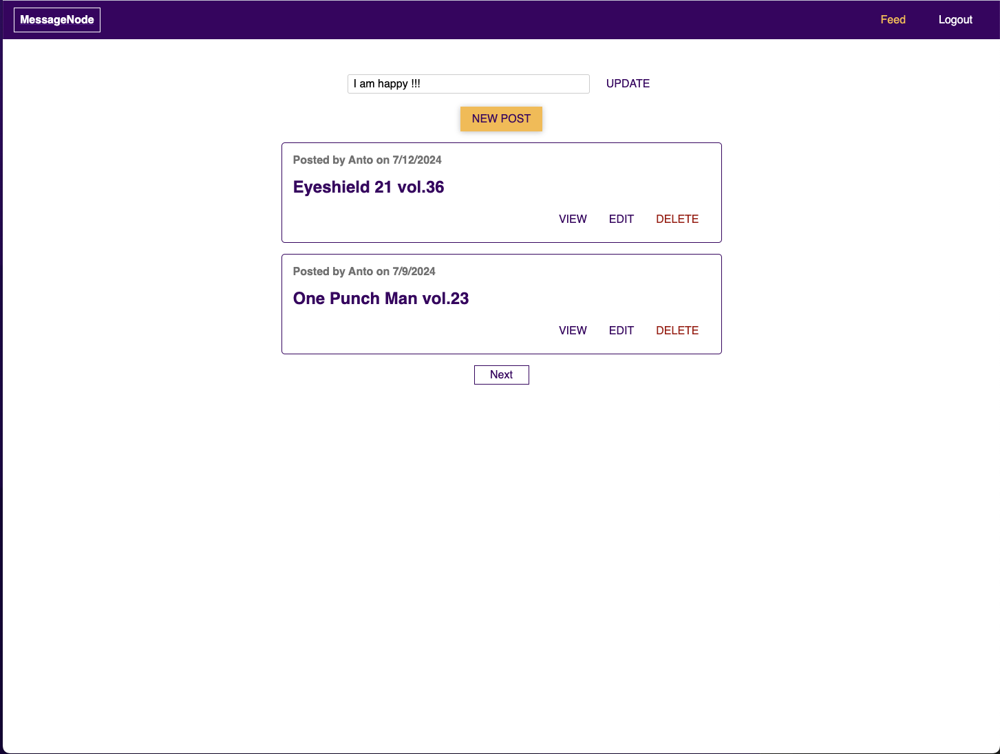

# Node.js Message Application

A Node.js message application demonstrating practical implementation of RESTful APIs and GraphQL for real-time messaging functionalities.

## Working with REST APIs and GraphQL

- **RESTful API Implementation:**

  - Building CRUD operations for managing messages.
  - Implementing user authentication and authorization mechanisms.
  - Handling errors, validation, and middleware application.

- **GraphQL Integration:**
  - Defining GraphQL schema for message types, queries, mutations, and subscriptions.
  - Utilizing GraphQL subscriptions for real-time message updates.
  - Optimizing data fetching and state management strategies.

## Technologies Covered

- Node.js and Express for RESTful API development.
- GraphQL implementation.
- Authentication strategies like JWT tokens.
- Integration with MongoDB and NoSQL databases.

## Educational Focus

- Learning best practices for API design, performance optimization, and security in real-time messaging contexts.
